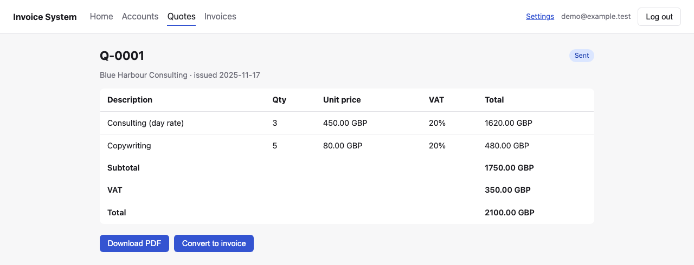

# Invoice System

A freelancer/small-business billing tool: **Account** (the client you bill)
→ **Quote** → **Invoice**, where a quote converts into an invoice rather
than the two being created independently. Every quote and invoice is
exportable as a PDF, each line item carries its own UK VAT rate, and a sent
invoice can be marked paid.


**Status: backend + web client implemented and tested.** Python backend
(SQLite storage, FastAPI behind login via
[sessionkit](https://github.com/atownsend247/bb-py-sessionkit), plus a
mirrored CLI) and a React/Vite SPA (`web/`). See
[`docs/roadmap.md`](docs/roadmap.md) for phase-by-phase status and what's
still ahead (partial payments, TOTP/2FA, email delivery).

## Features

- **Accounts** — create and edit the businesses you invoice.
- **Quotes → Invoices** — draft, send, accept/reject/expire a quote;
  convert an accepted quote into an invoice with one click, copying its
  line items across.
- **Per-line VAT** — each line item picks its own rate (standard, reduced,
  or zero); quotes and invoices show a Subtotal / VAT / Total breakdown.
- **Payments** — mark a sent invoice paid; the home dashboard tracks
  overdue and outstanding invoices and a 12-month paid-vs-outstanding chart.
- **PDF export** — quotes and invoices, independently, from the web UI or
  the CLI.
- **Settings** — your own business profile (name, UK address, payment
  terms, reporting currency, UTR/VAT number), shown as the "From" party on
  generated PDFs.
- **CLI** — `invoice-system-cli` mirrors everything the web UI does, over
  the same storage.
- **Demo data** — a fresh `init-db` seeds a year of realistic demo data
  (accounts, quotes/invoices in every status, a demo login) by default,
  so there's something to look at immediately.

<table>
<tr>
<td></td>
<td></td>
</tr>
</table>

## Quick start

```
uv sync
uv run invoice-system-cli init-db      # seeds demo data + a demo login by default
cd web && npm install && npm run dev
```

Log in with `demo@example.test` / `demo-password-123`. See
[`docs/development.md`](docs/development.md) for the full walkthrough,
including running without demo data and serving on your local network.

## Docs

- [`CLAUDE.md`](CLAUDE.md) — conventions and architecture rules for anyone
  (human or agent) working in this repo.
- [`docs/development.md`](docs/development.md) — how to run it.
- [`docs/architecture.md`](docs/architecture.md) — layering, storage,
  dependency injection, error handling.
- [`docs/data-model.md`](docs/data-model.md) — entities and relationships.
- [`docs/api.md`](docs/api.md) — endpoint reference.
- [`docs/roadmap.md`](docs/roadmap.md) — phase status.
- [`docs/testing-and-ci.md`](docs/testing-and-ci.md) — test layout, fixtures,
  coverage, CI shape.
- [`docs/deployment.md`](docs/deployment.md) — the Jenkins pipeline and
  Proxmox LXC deployment setup.
- [`docs/extracting-reusable-packages.md`](docs/extracting-reusable-packages.md)
  — playbook for carving a cross-cutting concern into its own package.
- [`web/README.md`](web/README.md) — the web client: where things are, how
  to run/test/build it.
