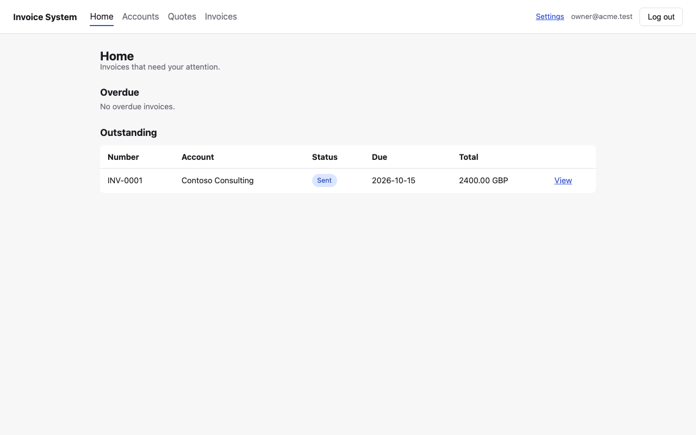
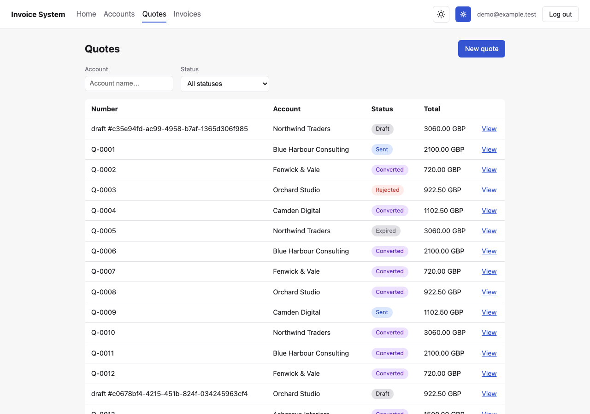
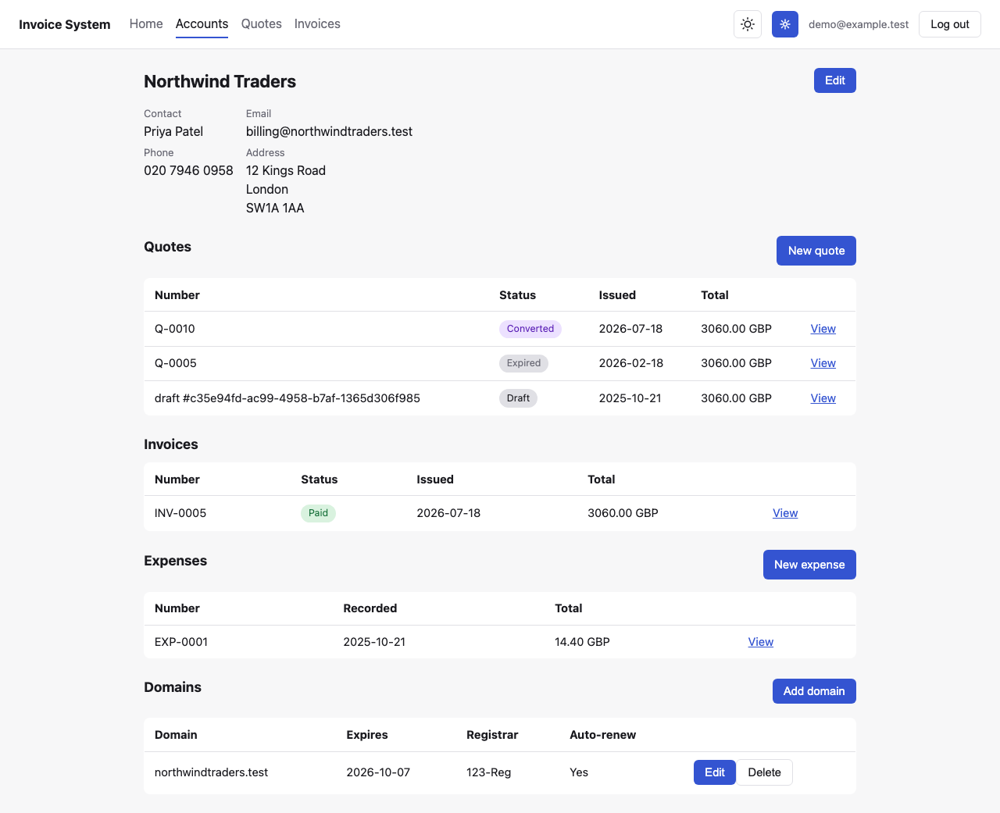
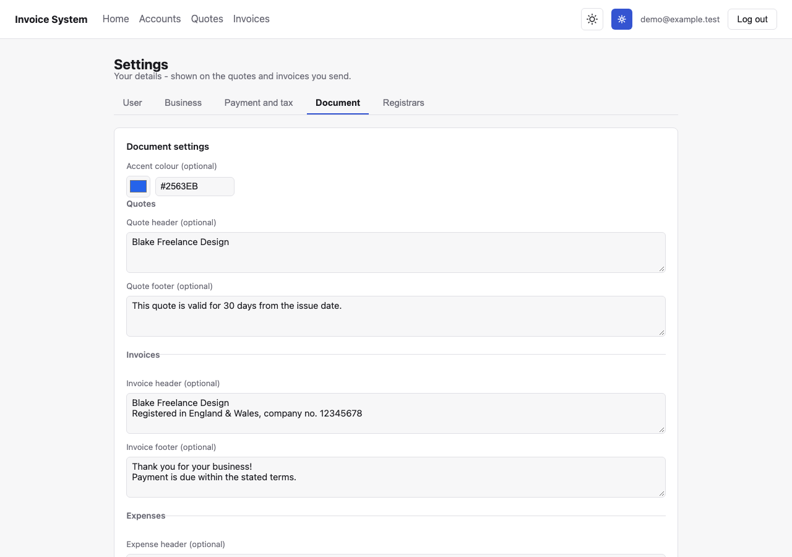
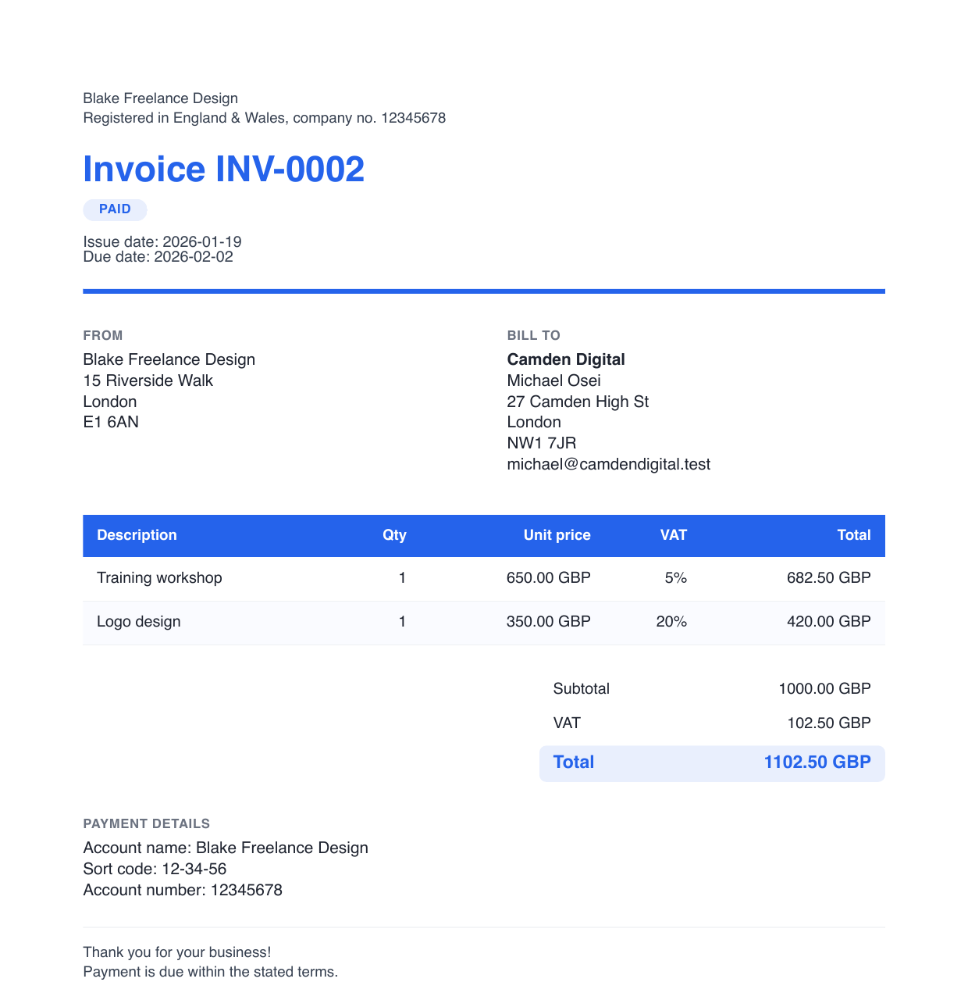

# Invoice System

A freelancer/small-business billing tool: **Account** (the client you bill)
→ **Quote** → **Invoice**, where a quote converts into an invoice rather
than the two being created independently. Every quote, invoice, and expense
is exportable as a styled PDF, each line item carries its own UK VAT rate,
and a sent invoice can be marked paid.



**Status: backend + web client implemented and tested.** Python backend
(SQLite storage, FastAPI behind login via
[sessionkit](https://github.com/atownsend247/bb-py-sessionkit), plus a
mirrored CLI) and a React/Vite SPA (`web/`). See
[`docs/roadmap.md`](docs/roadmap.md) for phase-by-phase status and what's
still ahead (partial payments, TOTP/2FA, email delivery).


## Features

- **Accounts** — create, edit, and search the businesses you invoice, each
  with its own quotes, invoices, expenses, and domains, and its own
  detail page.
- **Quotes → Invoices** — draft, send, accept/reject/expire a quote;
  convert an accepted quote into an invoice with one click, copying its
  line items across, with a link back to the invoice from the quote it
  came from.
- **Per-line VAT** — each line item picks its own rate (standard, reduced,
  or zero); quotes and invoices show a Subtotal / VAT / Total breakdown.
- **Expenses** — record costs incurred against an account (e.g. a domain
  renewal paid on a client's behalf), with their own line items and
  uploaded receipt PDFs. An expense's date is tracked separately from when
  it was recorded, so backdating an entry attributes it to the month it
  actually happened on the home dashboard's chart.
- **Domains** — track which domains a client owns, their expiry date, and
  who they're registered with, picked from a managed list of registrars
  you maintain in Settings.
- **Payments** — mark a sent invoice paid; the home dashboard tracks
  overdue and outstanding invoices and a 12-month
  paid/outstanding/expenses chart, plus all-time stats.
- **Styled PDF export** — quotes, invoices, and expenses render as actual
  HTML/CSS documents (not a generic template), with your own accent
  colour, a separate header and footer per document type, and bank
  details shown on invoices — from the web UI or the CLI.
- **Tabbed settings** — your business profile (name, UK address, payment
  terms, reporting currency, UTR/VAT number, bank details), a PDF accent
  colour and per-document-type header/footer text, and your managed list
  of domain registrars.
- **Filtering and server-side pagination** — accounts, quotes, and
  invoices all filter (by name, account, or status) and paginate on the
  server, so the lists stay fast regardless of how much data you have.
- **Invite-gated registration** — a single-use `/register?token=...` link,
  created via the CLI, lets a new user sign themselves up without a public
  signup form.
- **Light/dark theme** — a manual toggle in the header, persisted across
  visits.
- **CLI** — `invoice-system-cli` mirrors everything the web UI does, over
  the same storage.
- **Demo data** — a fresh `init-db` seeds a year of realistic demo data
  (accounts, quotes/invoices/expenses in every status, domains, a demo
  login) by default, so there's something to look at immediately.

<table>
<tr>
<td></td>
<td></td>
</tr>
<tr>
<td></td>
<td></td>
</tr>
</table>

## Quick start

```
uv sync
uv run invoice-system-cli init-db      # seeds demo data + a demo login by default
cd web && npm install && npm run dev
```

Log in with `demo@example.test` / `demo-password-123`. See
[`docs/development.md`](docs/development.md) for the full walkthrough,
including running without demo data and serving on your local network.

## Docs

- [`CLAUDE.md`](CLAUDE.md) — conventions and architecture rules for anyone
  (human or agent) working in this repo.
- [`docs/development.md`](docs/development.md) — how to run it.
- [`docs/architecture.md`](docs/architecture.md) — layering, storage,
  dependency injection, error handling.
- [`docs/data-model.md`](docs/data-model.md) — entities and relationships.
- [`docs/api.md`](docs/api.md) — endpoint reference.
- [`docs/roadmap.md`](docs/roadmap.md) — phase status.
- [`docs/testing-and-ci.md`](docs/testing-and-ci.md) — test layout, fixtures,
  coverage, CI shape.
- [`docs/deployment.md`](docs/deployment.md) — the Jenkins pipeline and
  Proxmox LXC deployment setup.
- [`docs/extracting-reusable-packages.md`](docs/extracting-reusable-packages.md)
  — playbook for carving a cross-cutting concern into its own package.
- [`web/README.md`](web/README.md) — the web client: where things are, how
  to run/test/build it.
